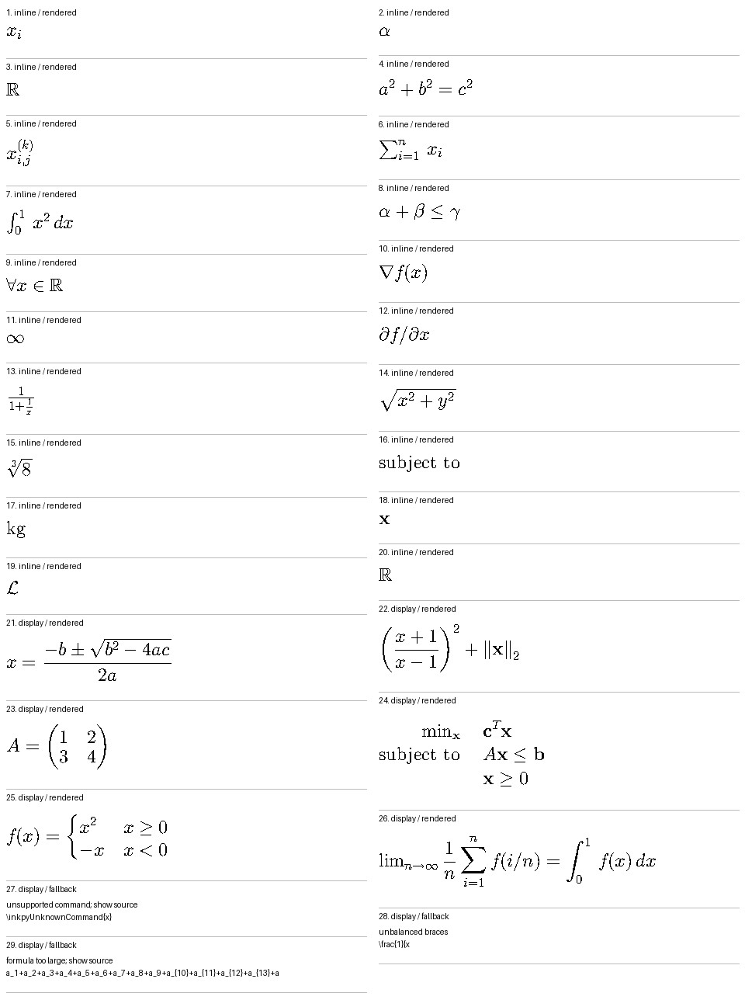

# Stage 3 result — math and fonts

2026-10-01. Host experiment complete; **not device-validated**.

## Decision

Keep MicroTeX as the math candidate behind a narrow C API. The small custom
FreeType backend can render the acceptance corpus without a desktop GUI stack.
This establishes useful coverage, not full compatibility or a firmware memory
fit. Do not integrate it into the product reader until the device resource gate
and remaining typography checks pass.

Implementation/reproduction: [prototypes/math](../prototypes/math/README.md).
The main IDF diagnostic is unchanged. No code was flashed or executed on X4 Pro.

## Results

- MD4C extracted 29 formulas: 20 inline and 9 display. Code fences, inline code,
  escaped dollars and the deliberately unclosed delimiter were not rendered as
  math. Corpus extraction counts/styles are asserted by the harness.
- 26 rendered: indices, Greek and set symbols, operators, fractions, roots,
  text styles, delimiters, matrix, aligned constraints and cases.
- 3 expected fallbacks: unknown command, malformed brace grouping, expression
  wider than the page. Each returns an error and clears partial pixels. The
  contact sheet labels them and shows a source excerpt; it is not reader UI.
- 16 additional checks passed: malformed/oversized/deep input, forbidden commands
  and environments, command/cell budgets, Unicode fallback, recovery after
  failure, font-size bound, and visible minus glyphs at 12/24/40px.
- Contact sheet visually inspected at 24px. Native TrueType hinting initially
  erased minus signs and portions of other symbols. `FT_LOAD_NO_HINTING` fixes
  that observed failure; the minus regression check catches its return.
- Visible follow-up: `lim` and `min` limits appear beside their operators in these
  display examples. Investigate MicroTeX's operator-limit layout before claiming
  normal LaTeX display typography. Deep inline fractions also become very small;
  text-line integration/readability remains untested.

[Per-formula results](results/stage3/formulas.tsv) and
[host metrics](results/stage3/metrics.txt) are retained from the final run.

## Measured resources and limits

Linux x86-64, GCC 13.3.0, Release/C++17, CMake 3.30.9, Ninja 1.13.2.
FreeType 2.13.3; dependency commit pins are enforced in the reproduction script.
Preview assembly used Pillow 12.3.0; the renderer itself is native C/C++.

| Measurement | Final host run | Meaning |
|---|---:|---|
| Fixed bitmap | 48,000 bytes | 480x800, one bit/pixel; excludes all other memory |
| Font face cache | 4 slots | Bounds face count, not each face's allocations |
| Math font resources | 458,568 bytes / 30 TTFs | Storage; not all simultaneously resident |
| Live glibc heap before / after init | 387,520 / 499,728 bytes | Process samples; includes harness and upstream statics |
| Largest post-formula heap sample | 571,264 bytes | Does **not** capture transient layout/glyph peaks |
| Heap after release | 495,888 bytes | Not a leak-free proof; statics/caches remain |
| Peak process RSS | 4,608 KiB | Includes host runtime/code/shared pages; not MCU heap |
| Formula render times | 17–331 µs; median 92 µs | One host run, successful formulas; not a device benchmark |
| Executable text / data / BSS | 2,272,571 / 38,392 / 52,240 bytes | Host linked sections, not Xtensa flash/RAM estimates |

Four faces plus the fixed bitmap are explicit limits. MicroTeX's dynamic parser,
layout tree, STL, FreeType allocations and tinyxml2 remain outside a hard heap
budget. The host numbers neither prove nor disprove MCU fit. Full-document
processing is not implemented; this test intentionally reads only a small fixture.

## Next bounded task

After the user's next continuation, port this isolated renderer into an optional
ESP32-S3 diagnostic build. Resolve operator-limit placement, trim the selected
fonts/FreeType build, and add internal/PSRAM peak-allocation and stack reporting.
Do not build the full reader/editor/Python stack in that stage. Actual rendering,
latency and memory measurements still require the hardware handoff in BRINGUP.md.
Without a device, record build evidence only and pause at runtime acceptance.
